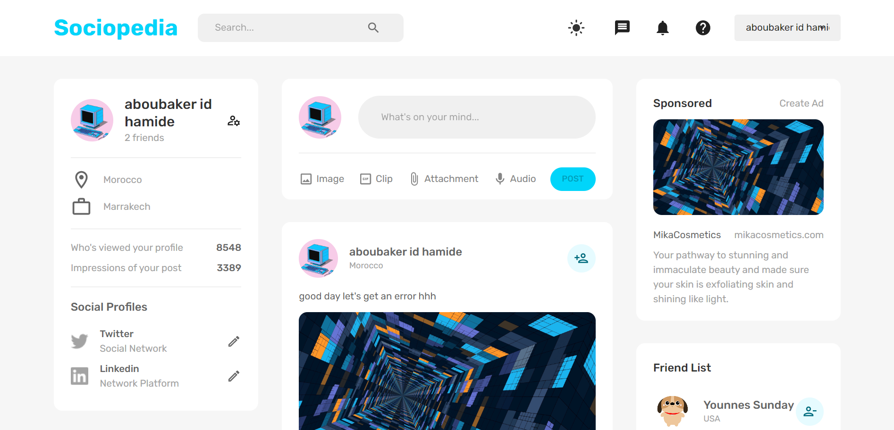

# Blog Application

This is a MERN (MongoDB, Express.js, React.js, Node.js) blog application with a focus on the backend implementation. The application allows users to create, update, and delete blog posts. User authentication is implemented using JSON Web Tokens (JWT) for secure access. While the frontend of the application is based on a pre-existing template, the main focus of this project was to gain a deeper understanding of the backend processes and best practices within the MERN stack.

## Screenshot

